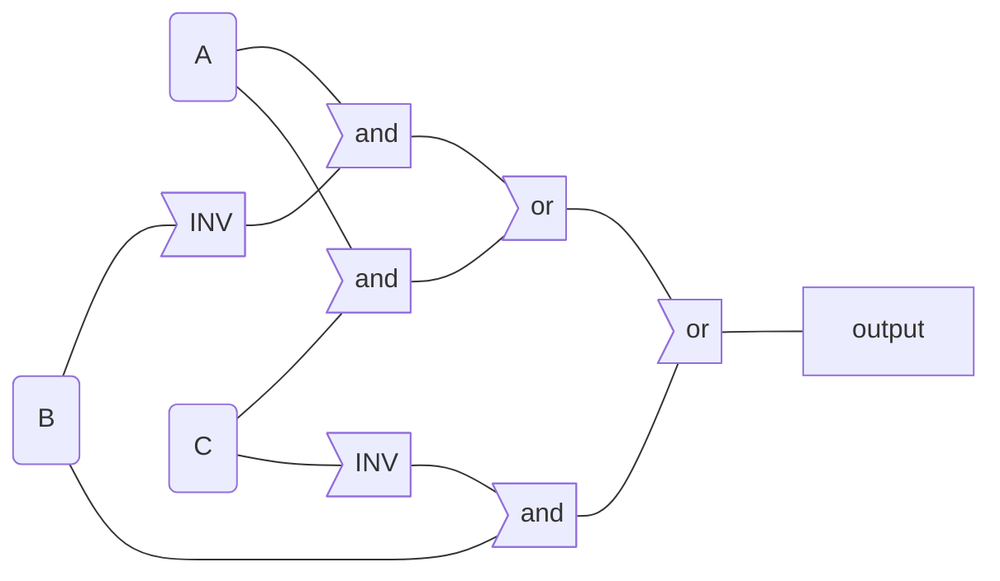
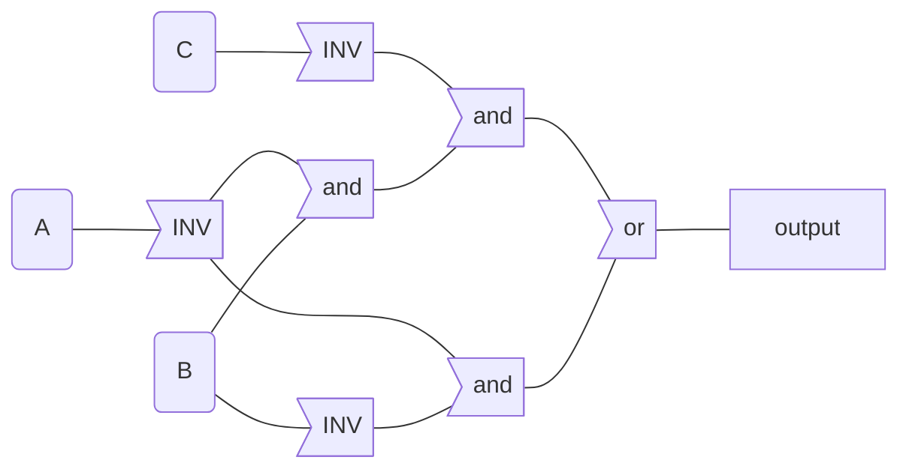
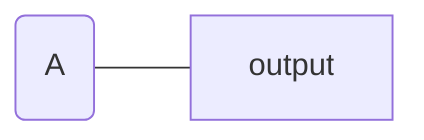
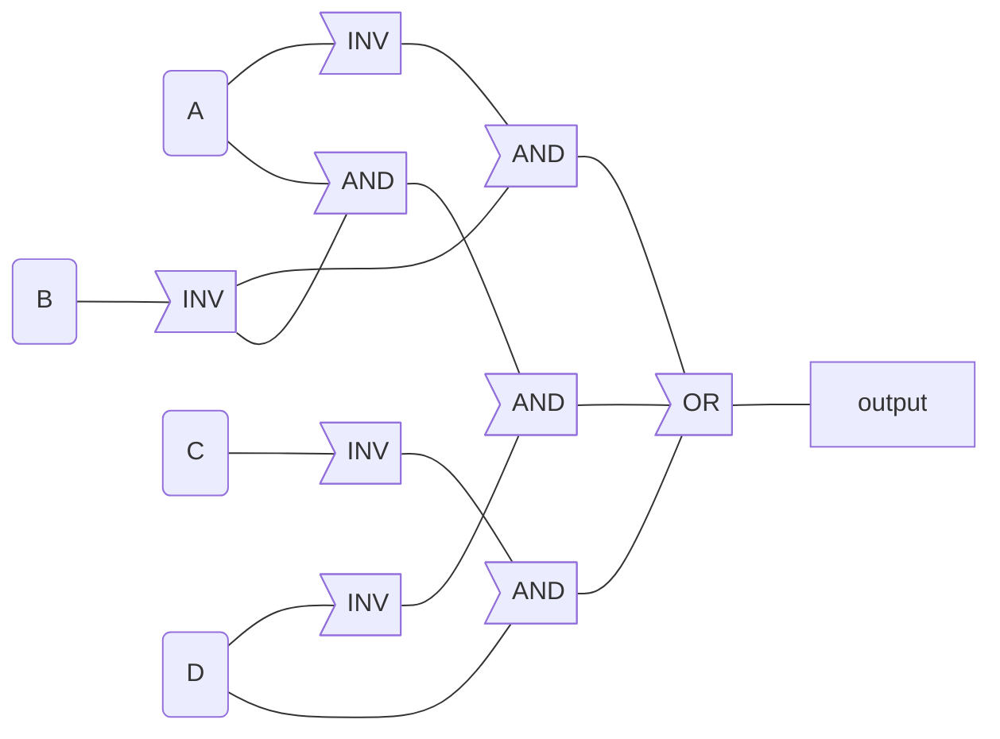
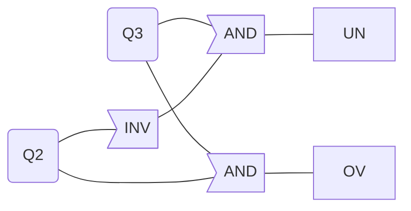
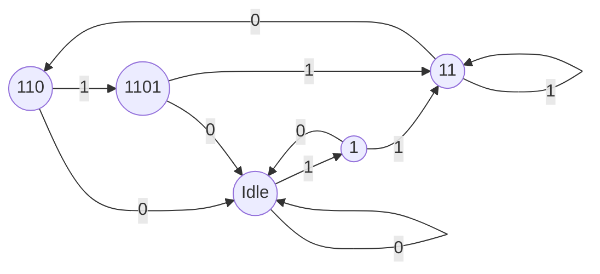

# 112 Intro to Computer Systems Coursework

## Coursework 1 - Data Representation

#### 1

$188_{10}\Rightarrow 1011\ 1100_2 \Rightarrow 274_8 \Rightarrow \mathrm{BC_{16}}$

#### 2

$\mathrm{ABC_{16} \Rightarrow 1010\ 1011\ 1100_2 \Rightarrow 5274_8 \Rightarrow 2748_{10}}$

#### 3

$$
\ \ \ \ 1111\ 0000\ 1111\ 0000\ 1111\\
+1010\ 1010\ 1011\ 1111\ 1111\\
\rule{8cm}{0.5pt}\\
\mathrm{\ 1\ 1001\ 1011\ 1011\ 0000\ 1110}\\
\mathrm{c:1110\ 0000\ 1111\ 1111\ 1111}
$$

#### 4

$$
\ \ \ \ 1111\ 0000\ 1111\ 0000\ 1111\\
-1010\ 1010\ 1011\ 1111\ 1111\\
\rule{8cm}{0.5pt}\\
\mathrm{\ 1\ 0100\ 0110\ 0011\ 0001\ 0000}\\
\mathrm{b:0000\ 1110\ 0011\ 1111\ 0000}
$$

#### 5

$$
\ \ \ 10101\\
*10101\\
\rule{8cm}{0.5pt}\\
\ \ \ 10101\\
10101\ \ \ \ \ \\
+10101\ \ \ \ \ \ \ \ \ \ \ \ \ \ \ \ \ \\
\rule{8cm}{0.5pt}\\
1\ 1011\ 1001\ \ \ \ \ \ \ \ \ 
$$

#### 6

$14_5 \Rightarrow (5+4)_{10} \Rightarrow 0\ 0000\ 0000_1$

#### 7

1. $2^8$
2. $2^{10}$
3. $2^{16}$

#### 8

1. Sign and magnitude: $1010\ 0101$
2. One's complement: $1101\ 1010$
3. Two's complement: $1101\ 1011$
4. Excess-256: $1101\  1011$
5. Excess-128: $0101\ 1011$

#### 9

1. Sign & magnitude: $-2^{9}-1\sim2^9-1$
2. One's complement: $-2^9-1\sim2^9-1$
3. Two's complement: $-2^9\sim2^9-1$
4. Excess-512: $-2^9\sim2^9-1$

#### 10

$$
\ \ \ \ 1010\ 1010\ 1011\\
-1011\ 0000\ 1101\\
\rule{8cm}{0.4pt}\\
\ \ \ \ 1111\ 1001\ 1110
$$

The result in decimal is $-98_{10}$

#### 11

$1001\ 1000\ 0111\ 0110\ 0101_\mathrm{BCD}$

#### 12

| Char | Binary    | Hex  |
| ---- | --------- | ---- |
| A    | 0100 0001 | 4 1  |
| :    | 0011 1010 | 3 A  |
| =    | 0011 1101 | 3 D  |
| q    | 0111 0001 | 7 1  |
| *    | 0010 1010 | 2 A  |
| t    | 0111 0100 | 7 4  |


## Coursework 2 - Boolean Algebra

#### 1

Enter through door 1 or door 3

#### 3

1. $A \times (1-B)$
2. $A+B-A\times B$
3. $1-(A\times B)$
4. $A+B-2\times (A\times B)$

#### 5

We know from de Morgan's theorem that 
$$
(A+B)'=A'\cdot B'
$$
We prove by induction and let $B=(A_1+A_2+A_3+...A_n)'$, assuming that de Morgan's theorem is true for $n$ variables. That is, $B'=A_1'\cdot A_2' \cdot A_3' \cdot...\cdot A_n'$. We now prove it's true for $n+1$ variables as well.
$$
\begin{align}(B+A_{n+1})'&=B'\cdot A_{n+1}'\\
(A_1+A_2+A_3+...A_n+A_{n+1})'&=A_1'\cdot A_2' \cdot A_3' \cdot...\cdot A_n'
\end{align}
$$
We now have shown that this is correct for $n+1$ variables as well, and it is true for any number of variables.

## Coursework 3 - Boolean Equations

#### 1

1. $R=(A'+B+B')\cdot B=B$
2. $\begin{align} R&=A+((A'+B)\cdot C)\\&=A+A'\cdot C+B\cdot C\\&=A\cdot (C+C')+A'\cdot C+B\cdot C\\&=A\cdot C+A\cdot C'+A'\cdot C+B\cdot C\\&=C+A\cdot C'+B\cdot C\\&=C+A\cdot C'\\&=(C+A)(C+C')\\&=A+C\end{align}$
3. $R=A+(B'\cdot C'\cdot A)=A$

#### 2

1. ```mermaid
   graph LR
   B(B) --> output
   ```

2. ```mermaid
   graph LR
   A(A) --> C(or)
   B(B) --> C
   C --> output
   ```

3. ```mermaid
   graph LR
   A(a) --> output
   ```

#### 3

Truth table:

| A    | B    | C    | R    |
| ---- | ---- | ---- | ---- |
| 0    | 0    | 0    | 0    |
| 0    | 0    | 1    | 1    |
| 0    | 1    | 0    | 1    |
| 0    | 1    | 1    | 1    |
| 1    | 0    | 0    | 1    |
| 1    | 0    | 1    | 1    |
| 1    | 1    | 0    | 1    |
| 1    | 1    | 1    | 0    |

K-map:

| A \ BC | 00   | 01   | 11   | 10   |
| ------ | ---- | ---- | ---- | ---- |
| 0      | 0    | 1    | 1    | 1    |
| 1      | 1    | 1    | 0    | 1    |

Min-term:
$$
Minterm=A\cdot B'+A'\cdot C+B\cdot C'
$$
The circuit:



#### 4

Max-term:
$$
\begin{align}
Maxterm&=(A+B+C)(A'+B'+C')\\
&=(A\cdot A'+A\cdot B'+A\cdot C')+(B\cdot A'+B\cdot B'+B\cdot C')+(C\cdot A'+C\cdot B'+C\cdot C')\\
&=(A\cdot B'+A\cdot C')+(B\cdot A'+B\cdot C')+(C\cdot A'+C\cdot B')\\
&=A\cdot B'+A'\cdot C+B\cdot C'+(B\cdot A'+A\cdot C'+C\cdot B')\\
&=A\cdot B'+A'\cdot C+B\cdot C'

\end{align}
$$

#### 5

Truth table

| A B C | S1   | S2   | S3   | S4   | S5   | R    |
| ----- | ---- | ---- | ---- | ---- | ---- | ---- |
| 0 0 0 | 1    | 0    | 1    | 1    | 1    | 1    |
| 0 0 1 | 1    | 0    | 1    | 1    | 1    | 1    |
| 0 1 0 | 1    | 1    | 0    | 1    | 1    | 1    |
| 0 1 1 | 1    | 1    | 0    | 0    | 0    | 0    |
| 1 0 0 | 0    | 1    | 1    | 1    | 1    | 0    |
| 1 0 1 | 0    | 1    | 1    | 0    | 1    | 0    |
| 1 1 0 | 0    | 1    | 0    | 1    | 1    | 0    |
| 1 1 1 | 0    | 1    | 0    | 0    | 0    | 0    |

K-map

| A \ BC | 0 0  | 0 1  | 1 1  | 1 0  |
| ------ | ---- | ---- | ---- | ---- |
| 0      | 1    | 1    | 0    | 1    |
| 1      | 0    | 0    | 0    | 0    |

Min-term:
$$
Minterm=A'\cdot B'+A'\cdot B\cdot C'
$$
Circuit:



K-map with don't cares:

| A \ BC | 0 0  | 0 1  | 1 1  | 1 0  |
| ------ | ---- | ---- | ---- | ---- |
| 0      | 1    | 1    | X    | 1    |
| 1      | 0    | 0    | 0    | 0    |

Min-term:
$$
Minterm=A'
$$
Circuit:



#### 6

K-map:

| AB \ CD | 00   | 01   | 11   | 10   |
| ------- | ---- | ---- | ---- | ---- |
| 00      | 1    | 1    | 1    | 1    |
| 01      | 0    | 1    | 0    | 0    |
| 11      | 0    | 1    | 0    | 0    |
| 10      | 1    | 1    | 0    | 1    |

Min-term:
$$
Minterm=A'\cdot B'+C'\cdot D+A\cdot B'\cdot D'
$$
Circuit:



#### 7

K-map for the first equation:

| AB \ CD | 00   | 01   | 11   | 10   |
| ------- | ---- | ---- | ---- | ---- |
| 00      | 0    | 0    | 0    | 0    |
| 01      | 0    | 0    | 1    | 0    |
| 11      | 0    | 1    | 0    | 1    |
| 10      | 0    | 0    | 1    | 0    |

Min-term:
$$
Minterm=A\cdot B\cdot C'\cdot D+A'\cdot B\cdot C\cdot D+A\cdot B\cdot C\cdot D'+A'\cdot B\cdot C\cdot D
$$
K-map for binary coded decimal numbers:

| AB \ CD | 00   | 01   | 11   | 10   |
| ------- | ---- | ---- | ---- | ---- |
| 00      | 0    | 0    | 0    | 0    |
| 01      | 0    | 0    | 1    | 0    |
| 11      | X    | X    | X    | X    |
| 10      | 0    | 0    | X    | X    |

Min-term:
$$
Minterm=A'\cdot B\cdot C\cdot D
$$


## Coursework 4 - Timing in Logic Circuits

#### 1

| A    | B    | C    | D    | E    | X    |
| ---- | ---- | ---- | ---- | ---- | ---- |
| 0    | 0    | 1    | 1    | 1    | 0    |
| 0    | 1    | 1    | 1    | 0    | 1    |
| 1    | 0    | 1    | 0    | 1    | 1    |
| 1    | 1    | 0    | 1    | 1    | 0    |

#### 2

| Gate \ Time(ns) | 0-2  | 2-4  | 4-6  | 6-8  | 8-10 | 10-12 | 12-14 |
| --------------- | ---- | ---- | ---- | ---- | ---- | ----- | ----- |
| A               | 1    | 0    | 0    | 0    | 1    | 1     | 1     |
| B               | 1    | 0    | 0    | 0    | 1    | 1     | 1     |
| C               | U    | 0    | 1    | 1    | 1    | 0     | 0     |
| D               | U    | U    | 1    | 1    | 1    | 0     | 1     |
| E               | U    | U    | 1    | 1    | 1    | 0     | 1     |
| X               | U    | U    | U    | 0    | 0    | 0     | 1     |

#### 3

Add two inverter between AD and BE. This won't work when inverters have different time delays.


## Coursework 5 - Two Mode Counter Design

#### 1

| C1   | State | Q3   | Q2   | Q1   | State | Q3_next | Q2_next | Q1_next |
| ---- | ----- | ---- | ---- | ---- | ----- | ------- | ------- | ------- |
| 0    | 0     | 0    | 0    | 0    | 2     | 0       | 1       | 0       |
| 0    | 1     | 0    | 0    | 1    | 3     | 0       | 1       | 1       |
| 0    | 2     | 0    | 1    | 0    | OV    | 1       | 1       | 1       |
| 0    | 3     | 0    | 1    | 1    | OV    | 1       | 1       | 1       |
| 0    | UN    | 1    | 0    | 0    | 0     | 0       | 0       | 0       |
| 0    | X     | 1    | 0    | 1    | X     | X       | X       | X       |
| 0    | X     | 1    | 1    | 0    | X     | X       | X       | X       |
| 0    | OV    | 1    | 1    | 1    | OV    | 1       | 1       | 1       |
| 1    | 0     | 0    | 0    | 0    | UN    | 1       | 0       | 0       |
| 1    | 1     | 0    | 0    | 1    | UN    | 1       | 0       | 0       |
| 1    | 2     | 0    | 1    | 0    | 0     | 0       | 0       | 0       |
| 1    | 3     | 0    | 1    | 1    | 1     | 0       | 0       | 1       |
| 1    | UN    | 1    | 0    | 0    | UN    | 1       | 0       | 0       |
| 1    | X     | 1    | 0    | 1    | X     | X       | X       | X       |
| 1    | X     | 1    | 1    | 0    | X     | X       | X       | X       |
| 1    | OV    | 1    | 1    | 1    | 0     | 0       | 0       | 0       |

#### 2

K-maps for $D3, D2, D1$

D3: $Minterm=C1'\cdot Q2+C1\cdot Q2'$

| C1Q3 \ Q2Q1 | 00   | 01   | 11   | 10   |
| ----------- | ---- | ---- | ---- | ---- |
| 00          | 0    | 0    | 1    | 1    |
| 01          | 0    | X    | 1    | X    |
| 11          | 1    | X    | 0    | X    |
| 10          | 1    | 1    | 0    | 0    |

D2: $Minterm=C1'\cdot Q3'+C1'\cdot Q1$

| C1Q3 \ Q2Q1 | 00   | 01   | 11   | 10   |
| ----------- | ---- | ---- | ---- | ---- |
| 00          | 1    | 1    | 1    | 1    |
| 01          | 0    | X    | 1    | X    |
| 11          | 0    | X    | 0    | X    |
| 10          | 0    | 0    | 0    | 0    |

D1: $Minterm=Q3'\cdot Q2\cdot Q1+C1'\cdot Q1+C1'\cdot Q2$

| C1Q3 \ Q2Q1 | 00   | 01   | 11   | 10   |
| ----------- | ---- | ---- | ---- | ---- |
| 00          | 0    | 1    | 1    | 1    |
| 01          | 0    | X    | 1    | X    |
| 11          | 0    | X    | 0    | X    |
| 10          | 0    | 0    | 1    | 0    |

#### 3



#### 4

New K-map

D3: $Minterm=C1'\cdot Q2+C1\cdot Q2'$

| C1Q3 \ Q2Q1 | 00   | 01   | 11   | 10   |
| ----------- | ---- | ---- | ---- | ---- |
| 00          | 0    | 0    | 1    | 1    |
| 01          | 0    | 0    | 1    | 1    |
| 11          | 1    | 1    | 0    | 0    |
| 10          | 1    | 1    | 0    | 0    |

D2: $Minterm=C1'\cdot Q3'+C1'\cdot Q1$

| C1Q3 \ Q2Q1 | 00   | 01   | 11   | 10   |
| ----------- | ---- | ---- | ---- | ---- |
| 00          | 1    | 1    | 1    | 1    |
| 01          | 0    | 1    | 1    | 0    |
| 11          | 0    | 0    | 0    | 0    |
| 10          | 0    | 0    | 0    | 0    |

D1: $Minterm=Q3'\cdot Q2\cdot Q1+C1'\cdot Q1+C1'\cdot Q2$

| C1Q3 \ Q2Q1 | 00   | 01   | 11   | 10   |
| ----------- | ---- | ---- | ---- | ---- |
| 00          | 0    | 1    | 1    | 1    |
| 01          | 0    | 1    | 1    | 1    |
| 11          | 0    | 0    | 0    | 0    |
| 10          | 0    | 0    | 1    | 0    |

It will not be stuck in the wrong state.

## Coursework 6 - Binary Sequence Recogniser

#### 1



#### 2

| Input | State | State Type | Q3   | Q2   | Q1   | State | D3   | D2   | D1   |
| ----- | ----- | ---------- | ---- | ---- | ---- | ----- | ---- | ---- | ---- |
| 0     | 1     | Idle       | 0    | 0    | 0    | 1     | 0    | 0    | 0    |
| 0     | 2     | 1          | 0    | 0    | 1    | 1     | 0    | 0    | 0    |
| 0     | 3     | 11         | 0    | 1    | 0    | 4     | 0    | 1    | 1    |
| 0     | 4     | 110        | 0    | 1    | 1    | 1     | 0    | 0    | 0    |
| 0     | 5     | 1101       | 1    | 0    | 0    | 1     | 0    | 0    | 0    |
| 0     | 6     | X          | 1    | 0    | 1    | X     | X    | X    | X    |
| 0     | 7     | X          | 1    | 1    | 0    | X     | X    | X    | X    |
| 0     | 8     | X          | 1    | 1    | 1    | X     | X    | X    | X    |
| 1     | 1     | Idle       | 0    | 0    | 0    | 2     | 0    | 0    | 1    |
| 1     | 2     | 1          | 0    | 0    | 1    | 3     | 0    | 1    | 0    |
| 1     | 3     | 11         | 0    | 1    | 0    | 3     | 0    | 1    | 0    |
| 1     | 4     | 110        | 0    | 1    | 1    | 5     | 1    | 0    | 0    |
| 1     | 5     | 1101       | 1    | 0    | 0    | 3     | 0    | 1    | 0    |
| 1     | 6     | X          | 1    | 0    | 1    | X     | X    | X    | X    |
| 1     | 7     | X          | 1    | 1    | 0    | X     | X    | X    | X    |
| 1     | 8     | X          | 1    | 1    | 1    | X     | X    | X    | X    |

K-map for D3:

| IQ3 \ Q2Q1 | 00   | 01   | 11   | 10   |
| ---------- | ---- | ---- | ---- | ---- |
| 00         | 0    | 0    | 0    | 0    |
| 01         | 0    | X    | X    | X    |
| 11         | 0    | X    | X    | X    |
| 10         | 0    | 0    | 1    | 0    |

K-map for D2:

| IQ3 \ Q2Q1 | 00   | 01   | 11   | 10   |
| ---------- | ---- | ---- | ---- | ---- |
| 00         | 0    | 0    | 0    | 1    |
| 01         | 0    | X    | X    | X    |
| 11         | 1    | X    | X    | X    |
| 10         | 0    | 1    | 0    | 1    |

K-map for D1:

| IQ3 \ Q2Q1 | 00   | 01   | 11   | 10   |
| ---------- | ---- | ---- | ---- | ---- |
| 00         | 0    | 0    | 0    | 1    |
| 01         | 0    | X    | X    | X    |
| 11         | 0    | X    | X    | X    |
| 10         | 1    | 0    | 0    | 0    |

Minterm for D3: $D3=I\cdot Q_2\cdot Q_1$

Minterm for D2: $D2=I\cdot Q_3+Q_2\cdot Q_1'+I\cdot Q_2'\cdot Q1$

Minterm for D1: $D1=I\cdot Q_3'\cdot Q_2'\cdot Q_1'+I'\cdot Q_2\cdot Q_1'$

#### 3

Output logic: $R=Q_3\cdot Q_2'\cdot Q_1'$

#### 4

| Input | Current State | Q3   | Q2   | Q1   | Next State | D3   | D2   | D1   |
| ----- | ------------- | ---- | ---- | ---- | ---------- | ---- | ---- | ---- |
| 0     | 6             | 1    | 0    | 1    | 1          | 0    | 0    | 0    |
| 0     | 7             | 1    | 1    | 0    | 4          | 0    | 1    | 1    |
| 0     | 8             | 1    | 1    | 1    | 1          | 0    | 0    | 0    |
| 1     | 6             | 1    | 0    | 1    | 3          | 0    | 1    | 0    |
| 1     | 7             | 1    | 1    | 0    | 3          | 0    | 1    | 0    |
| 1     | 8             | 1    | 1    | 1    | 7          | 1    | 1    | 0    |

##  Coursework 7 - Binary Coded Decimal Adder

#### 1

K-map:

| Q3Q2 \ Q1Q0 | 00   | 01   | 11   | 10   |
| ----------- | ---- | ---- | ---- | ---- |
| 00          | 0    | 0    | 0    | 0    |
| 01          | 0    | 0    | 0    | 0    |
| 11          | 1    | 1    | 1    | 1    |
| 10          | 0    | 0    | 1    | 1    |

Minterm: $INC=Q_3\cdot Q_2+Q_3\cdot Q_1=Q_3\cdot (Q_2+Q_1)$

#### 2

K-map for the BCD Carry:

| Q3Q2 \ Q1Q0 | 00   | 01   | 11   | 10   |
| ----------- | ---- | ---- | ---- | ---- |
| 00          | X    | X    | X    | X    |
| 01          | 0    | 0    | 0    | 0    |
| 11          | 1    | 1    | 1    | 1    |
| 10          | 0    | 0    | 1    | 1    |

Minterm: $CARRY=Q_3\cdot Q_2+Q_3\cdot Q_1=Q_3\cdot (Q_2+Q_1)$

#### 3

The question mark should be replaced with a circuit that generates 0110 when the BCD carry-out is 1, and 0000 when BCD carry-out is 0. Thus, $Q_3$ and $Q_0$ could be 0 and $Q_2$ and $Q_1$ could be connected to carry-out directly