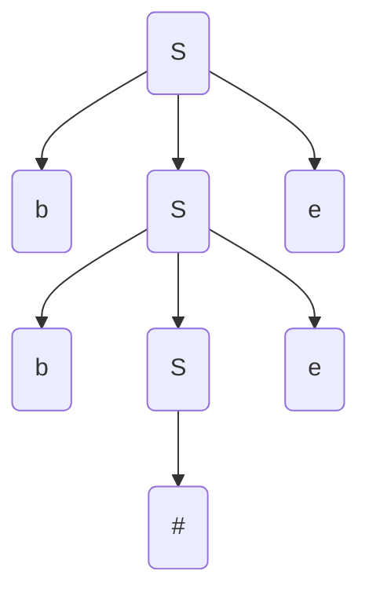

# 2020 Compiler Examination Solution

Hello, everyone! Don't forget to use this site just in case :)

***http://jsmachines.sourceforge.net/machines/lr1.html***

1. a. The regular expression for valid monetary value is

```
£(([1-9][0-9]?[0-9]? (,[0-9][0-9][0-9])*) | 0)(.[0-9][0-9])?
```

​		***The solution from 1b to 1f is also given in the tutorials from Naranker's website. So I'm gonna just copy paste his official answer here :)***

​		b. Below is the DFA of LR(1) items (***Just remember to have 3 states for recursive grammer like this one :)***)


​		c. The DFA of LALR(1) will merge the items/states that have the same `R -> a` but different look-ahead token. If we carefully observe the graph above, we know that state 2 and 5 can be merged, state 3 and 7 can be merged, state 4 and 8 can be merged, state 6 and 9 can be merged, resulting in a 6-state DFA of LALR(1) items.

​		d. The parse table of LR(1) looks like this


​		e. The parsing process looks like this


​		f. The parse tree looks like this



2. a. A pre-header is a node immediately before the header of a natural loop whose purpose is to hold the loop invariant to optimize the assembly code. When we want to move the loop invariant right before the header but there are multiple predecessors, we need to insert a pre-header between the multiple processors and the header to hold the loop invariant.

   b. A reaching definition is killed when there is a re-assignment happened to the variable associated with it.

   c. For `Exp` the `transExp` will be

   ```haskell
   -- The list of register represents the currently available registers.
   transExp :: Exp -> [Register] -> [Instr]
   transExp (r:rs) (Num i) = [Mov (ImmNum i) (Reg r)]
   transExp (r:rs) (Var x) = [Mov (Abs x) (Reg r)]
   transExp (r1:rs) (Plus e1 e2) = (transExp (r1:rs) e1) ++ (transExp rs e2) ++ [Add (Reg (head rs)) (Reg r1)]
   ```

   d. For `Assign` statement the `transStat` will look like this

   ```haskell
   transStat :: Stat -> [Register] -> [Instr]
   transStat rs (Assign x e)
     = transExp rs e ++ [Mov (Reg (head rs)) (Abs x)]
   ```

   e. The `For` loop translation looks like this

   ```haskell
   -- r1 could be freed because the initla value of e1 will be stored in x so no need to store it in r1
   transStat :: Stat -> [Register] -> [Instr]
   transStat regs@(r1:r2:rs) (For x e1 e2 statlist)
     = [Define "L0"] ++ e1Instr ++ e2Instr ++ [cmpInstr, bgeInstr] 
     		 ++ statlistInstr ++ [Add (ImmNum 1) (Reg r1), Bra "L0", Define "L1"]
       where e1Instr = transExp regs e1 ++ [Mov (Reg r1) (Abs x)]
             e2Instr = transExp (r2:rs) e2
             cmpInstr = Cmp (Abs x) (Reg r2)
             bgeInstr = Bge "L1"
             statlistInstr = concat (map (\stat -> transStat rs stat) statlist)
   ```

   f. The optmized version of `For` code generation provided that the loop bounds are known at compile-time is

   ```haskell
   --We are here to assume that both expressions in the for-loop headers are known numbers. There is the possibility for them to be Plus (Num <somenumber>) (Num <somenumber>) but I don't think that's the point of this question :)
   transStat :: Stat -> [Register] -> [Instr]
   transStat regs (For x e1 e2 statlist)
     | j - i > 0 = [Mov (ImmNum i) (Abs x)] ++ concat (take (j - i) (repeat (statlistInstr ++ [Add (ImmNum 1) (Abs x)])))
     | otherwise = []
       where (Num i) = e1 --e1 is a number if the bound is konwn
             (Num j) = e2
             statlistInstr = concat (map (\stat -> transStat regs stat) statlist)
   ```

   g. When the number of iteration is known at compiler-time AND is not significantly large, AND the number of instructions in the loop body is not too long. (e.g. $\#\text{iterations}\times\#\text{instructions}$ is not too big)

   ​	Therefore, as said, the compiler needs to take into count: 1⃣️ the nature of the loop body: whether it's simple linear instructions, or it is a nested for-loop or a complicated code strucuture (such as a loop in a piece of dead code that will occur so many times in the assembly file but it will never execute since it's dead code:) ). 2⃣️ If there are special instructions (such as the vector operations provided in x86) that can be used to do faster calculation, we might not want to unroll the for-loop and want to use the speical optimized instruction. 3⃣️ Compilation time: if unrolling the loop can significantly increase compilation time then we might not want to unroll it. :) (p.s. it takes ages to compile AOSP (around 45-80 minutes on a company-level server) so we do hope the compiler could be faster)

   ​	There are so many other answers and ppl can add to this anytime they want to :)