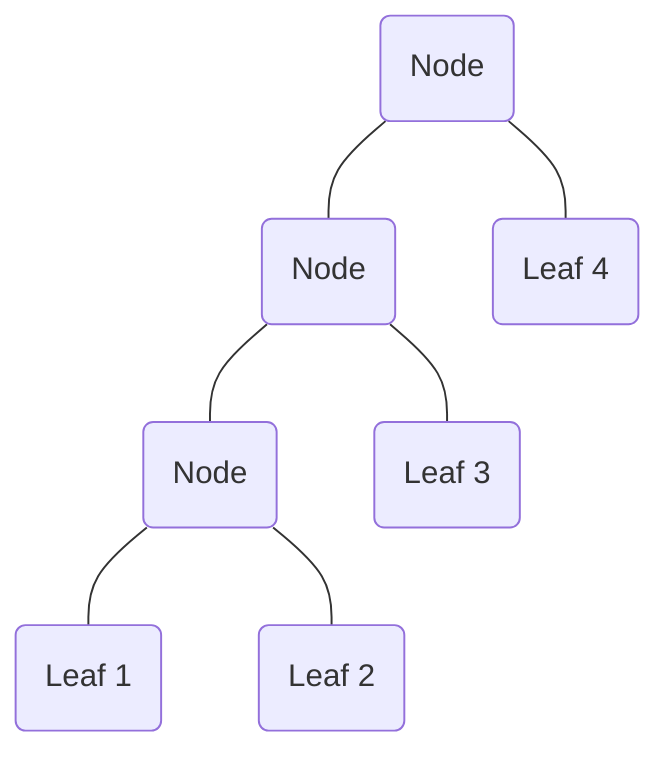

# 2021 Algorithm Design and Analysis Examination Solution

*Disclaimer: this solution only serves as a reference. Some answer may be incorrect or insufficient. If you think something is wrong just send me a message or leave a comment :)*

### 1a

i) The binary tree structure is as follows



ii) Below is the function `depth` measuring the depth of the tree

```haskell
depth :: Tree a -> Int
depth Leaf _   = 0
depth Node l r = 1 + (max (depth l) (depth r))
```

​	The depth of the tree given by `toTree xs` is `n-1`

iii) In worst case, the given tree structure will essentially look like a list where there is a chain of nodes forming towards the left side of the tree just like in i). The worst case complexity is then $O(n^2)$

The recurrence relation is then
$$
\begin{align}
T(n)&=T_{fromTree\ lt}(n-1)+T_{++}(n-1)+T_{fromTree\ rt}(1)\\
&=T(n-1)+(n-1)+1\\
&=T(n-1)+n\\
&=T(n-2)+(n-1)+n\\
&=1+2+3+...+n\\
&=\frac{n(1+n)}{2}
\end{align}
$$
which is bounded by $O(n^2)$

iv) The definition of `fromTree'` is shown below

```haskell
fromTree' :: Tree a -> [a]
fromTree' t = helper t []
  where helper :: Tree a -> [a] -> [a]
        helper (Leaf x) xs = (x:xs)
        helper (Node l r) xs = helper l (helper r xs)
```

### 1b

i) The implementation of `fold'` is shown below

```haskell
fold' :: (a -> a -> a) -> [a] -> a
fold' f list = helper f 0 (n-1) array
  where n = length list
        array = toArray list
        helper :: (a -> a -> a) -> Int -> Int -> Array Int a -> a
        helper f i j arr
          | i == j = arr ! i
          | otherwise = f (helper f i mid arr) (helper f (mid + 1) j arr)
            where mid = (i + j) `div` 2
```

ii) The definition of `fold''` is shown below

```haskell
fold'' :: (a -> a -> a) -> [a] -> a
fold'' f list = f (fold'' f left) (fold'' f right)
  where (left, right) = splitAt mid list
        mid = (length list) `div` 2
```


### 2a

i) The function `winning` is shown below

```haskell
-- In the helper function, the first argument (isMe) represents whose turn is currently going: True indicates us and False indicates opponent

winning :: Int -> Int -> Bool
winning k p = helper True k p
  where helper :: Bool -> Int -> Bool
        helper True 0  = False
        helper False 0 = True
        helper isMe p'
          | isMe      = or [helper False (p' - i) | i <- [1..k]]
          | otherwise = and [helper True (p' - i) | i <- [1..k]]
```

ii) The definition of `winning'` is shown below

```haskell
-- In the memo function, the first field of index indicates the player: 1 is us and 0 is opponent.

winning' :: Int -> Int -> Bool
winning' k p = table ! (1, p)
  where table = tabulate ((0, 0), (1, p)) (uncurry memo)
        memo :: Int -> Int -> Bool
        memo 1 0 = False
        memo 0 0 = True
        memo isMe p'
          | isMe == 1 = or [table ! (0, (p' - i)) | i <- [1..k]]
          | otherwise = and [table ! (1, (p' - i)) | i <- [1..k]]
```

The complexity of the function `winning'` is $O(kp)$ since each table requires building of $p$ elements and $k$ iterations of the variable $i$.

iii) The definition of `moves` is shown below

```haskell
-- In the memo function, the first field of index indicates the player: 1 is us and 0 is opponent.

moves :: Int -> Int -> [Int]
moves k p = fst (table ! (1, p))
  where table = tabulate ((0, 0), (1, p)) (uncurry memo)
        memo :: Int -> Int -> ([Int], Bool)
        memo 1 0 = ([], False)
        memo 0 0 = ([], True)
        memo isMe p'
          | isMe == 1 = let s = head (filter (\x -> snd (fst x)) [(table ! (0, (p' - i)), i) | i <- [1..k]]) in (snd s : fst (fst s))
          | otherwise = 
          	if and [table ! (1, (p' - i)) | i <- [1..k]] then
          		(fst (table ! (1, (p' - 1))), True)
          	else
            	([], False)
```

### 2b

i) The definition of `winning3` is shown below, implemented with memorisation

```haskell
winning3 :: Int -> Int -> Int -> Int -> Bool
winning3 k p q r = table ! (1, p, q, r)
  where table = tabulate ((0, 0, 0, 0), (1, p, q, r)) (uncurry memo)
        memo :: Int -> Int -> Int -> Int -> Bool
        memo 1 0 0 0 = False
        memo 0 0 0 0 = True
        memo isMe p' q' r'
          | isMe == 1 = or [or [table ! (0, p' - i, q', r') | i <- [1..k]], 
                            or [table ! (0, p', q' - i, r') | i <- [1..k]],
                            or [table ! (0, p', q', r' - i) | i <- [1..k]]]
          | otherwise = and [and [table ! (1, p' - i, q', r') | i <- [1..k]], 
                            and [table ! (1, p', q' - i, r') | i <- [1..k]],
                            and [table ! (1, p', q', r' - i) | i <- [1..k]]]
```

ii) The complexity of the function `winning3` is $O(kpqr)$

